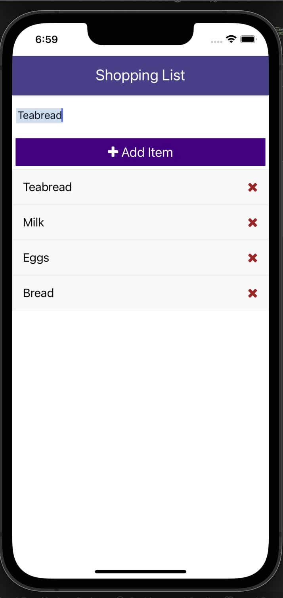

## react native application


## source
 - https://www.youtube.com/watch?v=Hf4MJH0jDb4&t=933s

## installation

- clone repo
- cd into directory
- run npm install
- run npm install uuidv4@6.2.12
- start the application with ``` npx react-native run-ios ``` 
- NB: make sure u have xcode install and added to path

- enjoy